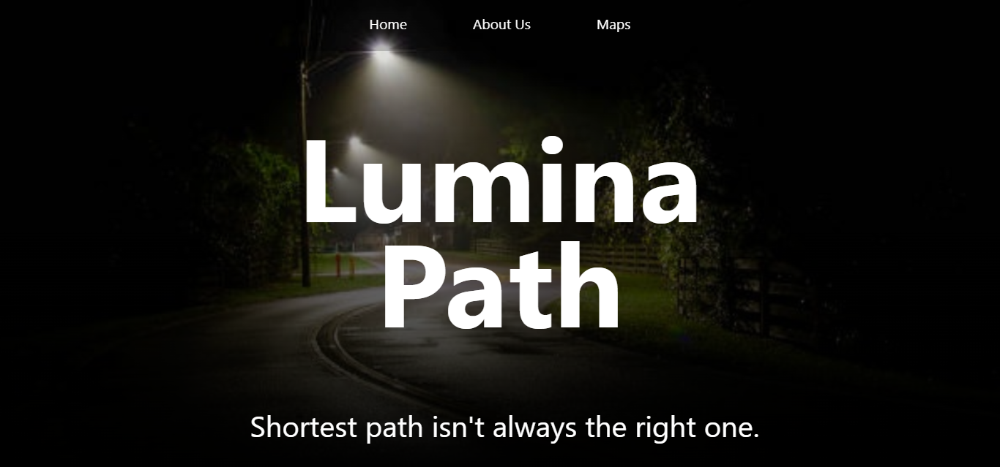
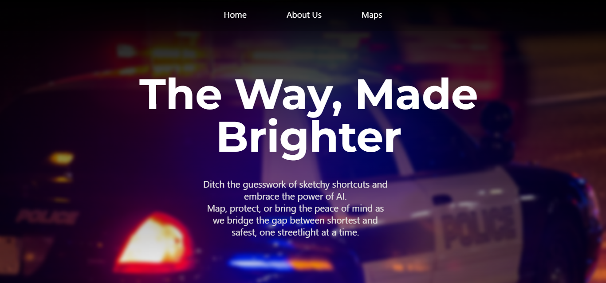
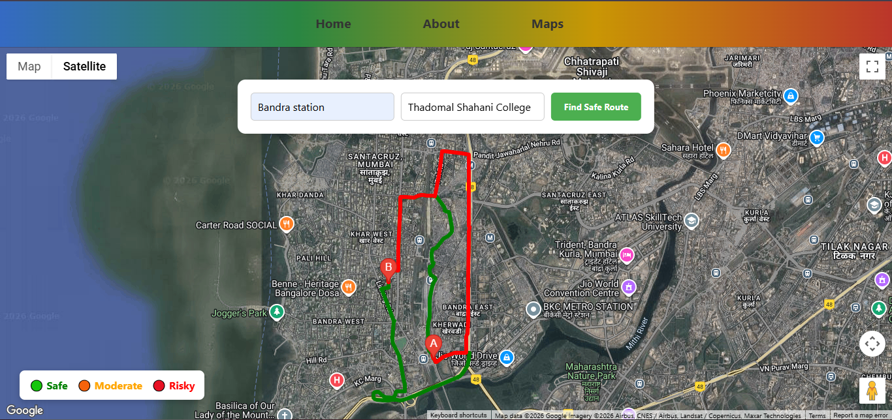

# 🔦 LuminaPath
> **"The fastest route isn't always the safest. We fix that."**

## 🚨 The Problem
Current navigation apps (Google Maps, Waze) are built for **efficiency**. They optimize for the shortest time and lowest traffic. 

However, for women, students, and solo travelers at night, **speed is not the priority—safety is**. A route that is 2 minutes faster but leads through a dark, unlit alley is a "bad route" for us.

## 💡 The Solution
**LuminaPath** is an intelligent safety layer built on top of Google Maps. 
Instead of just minimizing distance, our algorithm assesses the "Safety Score" of a path based on:
* **Visibility:** Streetlight density and dark zones.
* **Crowd Density:** Real-time busyness of the area.
* **Safe Anchors:** Proximity to 24/7 shops, police stations, and hospitals.

## ✨ Key Features
* **🛡️ Safety-First Routing:** Suggests alternative paths that are better lit and more populated.
* **🧠 AI Safety Analysis:** Provides a "Safety Score" and explains *why* a route is safe (e.g., *"This path passes a 24/7 Pharmacy"*).
* **🌑 Dark Mode UI:** Designed to be easy on the eyes in low-light environments.
* **📍 Safe Zones:** Visual markers for emergency help points along the path.

## 🛠️ Tech Stack
* **Frontend:** HTML5, CSS3 (Glassmorphism UI), JavaScript (Vanilla)
* **Mapping:** Google Maps JavaScript API
* **Intelligence:** Google Gemini (Prototype Integration)
* **Hosting:** GitHub Pages

## 📸 Screenshots
| **Home Pages** | **Home Pages** | **Safety Analysis** |
|:---:|:---:|:---:|
|  |  |  |

## 🚀 Live Demo
**[🌐 Click Here to Try LuminaPath Live](https://mihirkamat03.github.io/LuminaPath/)**

*(Note: Ensure Location Services are enabled for the best experience.)*

## 👥 The 3FA Team
Built with ❤️ at **[Hyphen'26 Hackathon]** by:
* **Mihir Kamat** - Full Stack Dev & Integration
* **Aarush Nalwade** - Research, Strategy, Presentation
* **Advait Jawalikar** - Frontend Design & UI/UX

---
*© 2026 LuminaPath. Open Innovation for Women's Safety.*