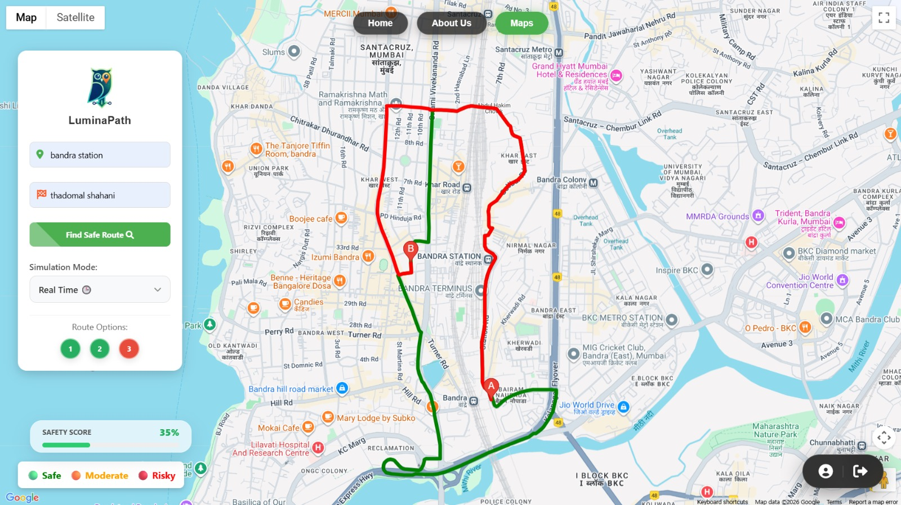
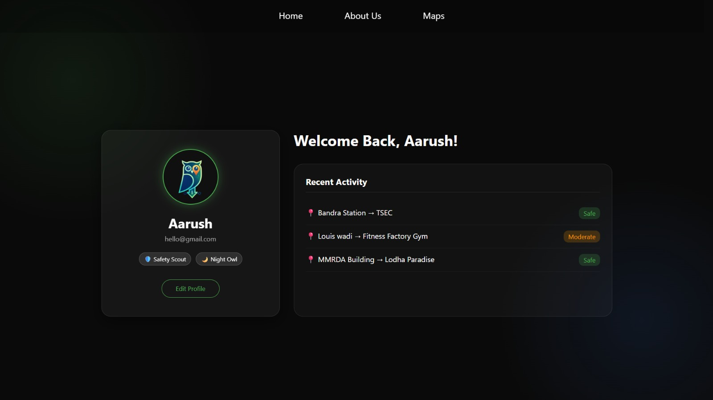

# 🔦 LuminaPath
> **"The fastest route isn't always the safest. We fix that."**


## 🚨 The Problem
Current navigation apps (Google Maps, Waze) are built for **efficiency**. They optimize for the shortest time and lowest traffic.

However, for women, students, and solo travelers at night, **speed is not the priority—safety is**. A route that is 2 minutes faster but leads through a dark, unlit alley is a "bad route" for us.

## 💡 The Solution
**LuminaPath** is an intelligent safety layer built on top of Google Maps.
Instead of just minimizing distance, our algorithm assesses the **"Safety Score"** of a path based on:
* **Context-aware Analysis:** Analyses multiple routes instead of one to make informed travelled decisions.
* **Safety Score:** Assigns a safety score based on well-lit main roads and the current time of day.
* **Visual risk Indicators:** Color coded routes for instant safety understanding.
* **Google Maps powered Navigation:** Accurate routing and safety intelligence.

---

## ✨ Key Features

### 🧠 The Intelligence Layer (Gemini AI)
We use rule based AI safety ogic, whihc assigns safety scores based on time and well-lit roads.

### 🎨 UI/UX Design
* **Cinematic Entrance:** Staggered animations for map elements, controls, and legends.
* **Glassmorphism 2.0:** A completely floating, immersive UI with glass capsules and blurred backdrops.

### 🔐 User System
* **Secure Auth:** Full Login/Register system powered by **Firebase Authentication**.
* **User Profiles:** Persists user history and badges (e.g., "Safety Scout") using **Firebase Realtime Database**.

---

## 🛠️ Tech Stack

| Component | Technology |
| :--- | :--- |
| **Frontend** | HTML5, CSS3 (Custom Keyframe Animations), JavaScript (ES6 Modules) |
| **Mapping** | Google Maps JavaScript API, Directions Service, Places API |
| **Backend** | Firebase (Authentication & Realtime Database) |
| **AI/ML** | Google Gemini Pro (Contextual Reasoning) |
| **Deployment** | Firebase Hosting / GitHub Pages |

---

## 📸 Screenshots

| **Immersive Home** | **Route Analysis** | **Profile & Stats** |
|:---:|:---:|:---:|
|  |  |  |

---

## 🚀 How to Run Locally

1.  **Clone the Repository**
    ```bash
    git clone [https://github.com/mihirkamat03/LuminaPath.git](https://github.com/mihirkamat03/LuminaPath.git)
    ```
2.  **Navigate to Folder**
    ```bash
    cd LuminaPath
    ```
3.  **Launch**
    Open `index.html` in your browser (or use Live Server in VS Code).

*(Note: For the Map features to work, ensure you have an active Internet connection as it fetches data from Google Maps & Firebase APIs).*

---

## 🗺️ Roadmap & Future Scope
* [ ] **IoT Integration:** Real-time connection to Smart City streetlights for live outage data.
* [ ] **AI/ML:** Machine learning model for smarter safety prediction.
* [ ] **React Native App:** Porting the web experience to a native mobile app.

---

## 🚀 Live Demo
**[🌐 Click Here to Try LuminaPath Live](https://mihirkamat03.github.io/LuminaPath/)**
*(Note: Ensure Location Services are enabled for the best experience.)*

---

## 👥 The Team (3FA)
Built with ❤️ at **Hyphen'26 Hackathon** by:

* **Mihir Kamat** - Full Stack Dev & System Architecture
* **Aarush Nalawde** - Strategy, AI Integration & Frontend
* **Advait Jawalikar** - UI/UX Design & Research

---
*© 2026 LuminaPath. Open Innovation for Women's Safety.*
